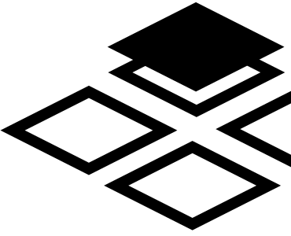

# TiledScene _for Godot 4_

TiledScene is an addon for [Godot 4](https://godotengine.org/) that provides a base scene tiled map feature to get the right node for TileMap coordinates.

You can install it via the Asset Library or [downloading a copy](https://github.com/NekoraiStudios/TiledScene/archive/refs/heads/main.zip) from GitHub.

## Contributors

TiledScene is made by [NekoraiSama](https://nekoraistudios.com)

## License

Licensed under the MIT license, see `LICENSE` for more information.

